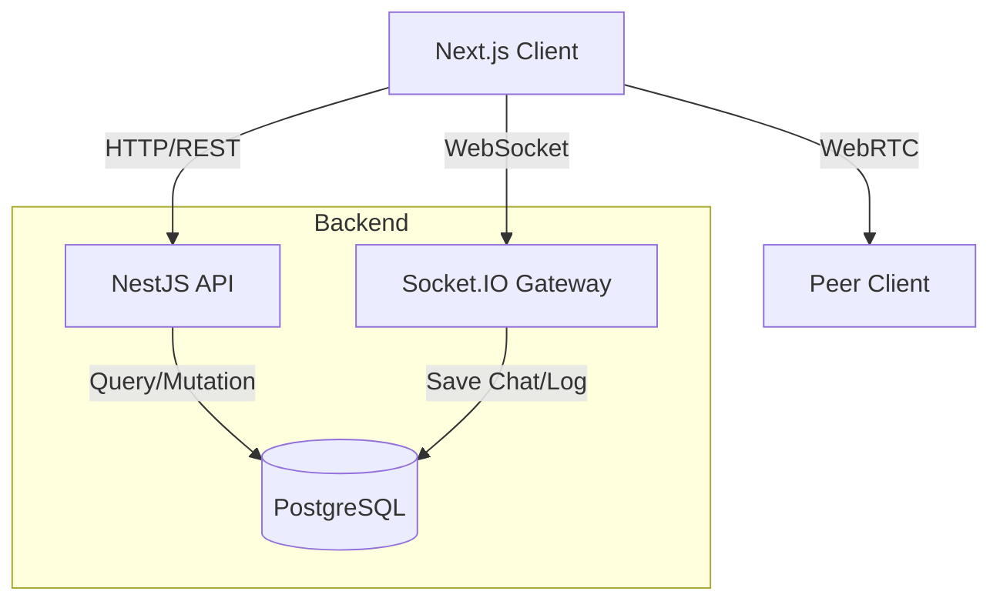
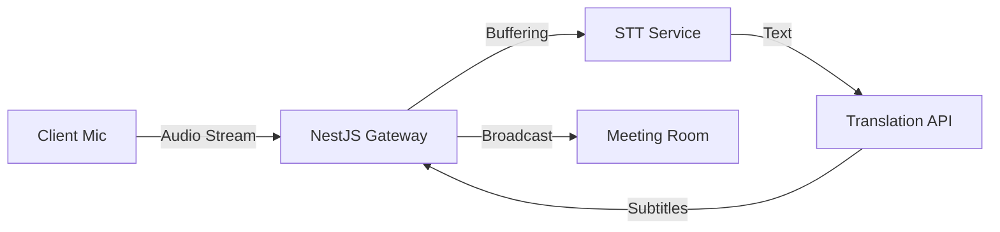

# AI-Meet 프로젝트 시스템 문서 (2024.11.28 업데이트)

> 이 문서는 현재 진행 중인 **AI-Meet** 프로젝트의 최신 아키텍처, 기술 스택, 시스템 상태 및 향후 계획을 기술합니다.

---

## 📊 시스템 개요

### 핵심 원칙
- **아키텍처**: Next.js (Client) ↔ WebSocket (Socket.IO) ↔ NestJS (Backend) ↔ PostgreSQL (Prisma)
- **실시간 통신**: WebRTC (Mesh/SFU Hybrid 지향), WebSocket을 통한 시그널링 및 채팅
- **UI**: Next.js 14 (App Router), shadcn/ui, Tailwind CSS, Lucide React
- **인증**: NextAuth.js (Google OAuth) + Prisma Adapter
- **개발 환경**: pnpm Workspace (Monorepo), Windows OS

---

## 🏗️ 아키텍처

### 1. 데이터 흐름



1.  **인증 (Auth)**:
    *   사용자는 **NextAuth.js**를 통해 Google 로그인을 수행합니다.
    *   로그인 성공 시 세션 쿠키가 생성되며, 클라이언트는 이를 통해 API 요청을 인증합니다.
    *   WebSocket 연결 시에도 인증된 세션 정보를 활용합니다.

2.  **회의 생성 (Meeting Creation)**:
    *   `POST /api/meeting`: 회의 방을 생성하고 DB에 `MeetingRoom` 레코드를 저장합니다.
    *   설정(채팅 저장 여부 등)을 함께 저장합니다.

3.  **실시간 통신 (Real-time)**:
    *   **Signaling**: Socket.IO를 통해 `offer`, `answer`, `ice-candidate`를 교환합니다.
    *   **Chat**: Socket.IO를 통해 메시지를 주고받으며, `isChatSaved` 설정에 따라 DB에 저장됩니다.
    *   **Media**: WebRTC `RTCPeerConnection`을 통해 P2P로 영상/음성을 교환합니다.

### 4. AI 미디어 처리 파이프라인 (STT & 번역) - *Planned*



1.  **오디오 스트리밍**:
    *   클라이언트에서 발화자의 오디오를 텍스트 변환용으로 다운샘플링하여 WebSocket으로 전송합니다.
    *   또는 WebRTC MediaServer(SFU) 도입 시 서버에서 직접 오디오를 추출합니다.
2.  **STT (Speech-to-Text)**:
    *   **OpenAI Whisper** 또는 **Google Cloud STT** API를 사용하여 실시간으로 텍스트로 변환합니다.
    *   비용 최적화를 위해 발화 감지(VAD) 시에만 API를 호출합니다.
3.  **실시간 번역**:
    *   변환된 텍스트를 **DeepL** 또는 **Google Translate** API를 통해 타겟 언어로 번역합니다.
4.  **자막 전송**:
    *   생성된 자막(원문/번역문)을 `subtitle` 이벤트로 룸 내 모든 사용자에게 브로드캐스트합니다.

### 5. 네트워크 불안정 대응 전략 (Network Resilience)

연결이 불안정하거나 대역폭이 낮을 때 사용자 경험을 유지하기 위한 전략입니다.

1.  **우선순위 제어 (Graceful Degradation)**:
    *   **Audio First**: 대역폭이 부족하면 비디오를 먼저 끄고 오디오 품질을 최우선으로 유지합니다.
    *   **Video Fallback**: 패킷 손실률(Packet Loss)이 5%를 넘으면 자동으로 저화질로 전환하거나 비디오를 일시 중단합니다.

2.  **적응형 비트레이트 (Adaptive Bitrate)**:
    *   WebRTC의 기본 혼잡 제어(Congestion Control)를 활용하되, 클라이언트에서 `RTCPeerConnection.getStats()`를 주기적으로 모니터링하여 상황에 맞는 UI 알림을 제공합니다.

3.  **재연결 로직 (Reconnection)**:
    *   `iceConnectionState`가 `disconnected` 또는 `failed`가 되면 즉시 **ICE Restart**를 시도합니다.
    *   완전 끊김 시 3초 간격으로 소켓 재연결을 시도하며, "재연결 중..." 토스트를 표시합니다.

### 2. 백엔드 구조 (NestJS)

*   **`apps/api`**:
    *   **`EventsGateway`**: WebSocket 이벤트를 처리하는 핵심 모듈.
        *   `handleConnection`: 클라이언트 접속 처리.
        *   `handleJoinRoom`: 방 입장 처리 (DB 유효성 검사 포함).
        *   `handleChatMessage`: 채팅 메시지 중계 및 DB 저장.
        *   `handleSignaling`: WebRTC 시그널링 중계.
    *   **`PrismaService`**: DB 접근을 위한 싱글톤 서비스.

### 3. 프론트엔드 구조 (Next.js)

*   **`apps/web`**:
    *   **`app/page.tsx`**: 메인 랜딩 페이지. 회의 생성/참여 UI.
    *   **`app/meeting/[roomId]/meeting-client.tsx`**: 화상 회의 핵심 클라이언트.
        *   WebRTC 연결 관리, 미디어 스트림 제어, 채팅 UI, 제어 바 등 포함.
    *   **`components/create-meeting-modal.tsx`**: 회의 생성 모달 (설정 포함).
    *   **`contexts/language-context.tsx`**: 다국어(I18n) 상태 관리.
    *   **`lib/i18n/dictionaries.ts`**: 한/영 번역 데이터.

---

## 📝 현재 진행 상황 (Current Status)

### ✅ 구현 완료 (Completed)

1.  **기반 시스템**:
    *   Next.js + NestJS 모노레포 환경 구축.
    *   PostgreSQL + Prisma ORM 연동.
    *   NextAuth.js 기반 구글 로그인.

2.  **화상 회의 핵심**:
    *   WebRTC 기반 P2P 화상 통화.
    *   마이크/카메라 토글, 장치 선택.
    *   실시간 채팅 (Socket.IO).

3.  **회의 관리 및 UX**:
    *   **회의 생성 모달**: "Zoom 스타일" UI, 채팅 저장/입장 시 음소거 등 옵션 설정.
    *   **제어 바**: 마우스 오버 시 자동 숨김 -> 수동 토글 버튼으로 변경.
    *   **다국어 지원 (I18n)**: 한국어/영어 전환 기능.
    *   **방 유효성 검사**: 존재하지 않는 방 ID로 접근 차단.

### 🚧 진행 중 / 예정 (In Progress / Planned)

**Phase 3: 완성도 향상 (Polish & Interactive)**
1.  **회의 제목 변경**: 호스트가 회의 중 제목을 실시간으로 변경.
2.  **이모지 반응 (Emoji Reactions)**: 화면에 떠오르는 이모지 애니메이션.
3.  **토스트 알림**: 입장/퇴장, 에러 등을 예쁜 팝업으로 표시.

**Future Roadmap**
*   **AI 기능 (STT & 번역)**:
    *   실시간 자막 생성 (OpenAI Whisper / Google STT).
    *   다국어 실시간 번역 자막.
    *   회의록 자동 요약 (LLM 활용).
*   **화면 공유 (Screen Sharing)**: `getDisplayMedia` 활용.
*   **참가자 관리**: 강제 퇴장, 음소거 제어 (호스트 권한).
*   **대기실 (Waiting Room)**: 호스트 승인 후 입장.

---

## ⚙️ 환경 변수 (Environment Variables)

### 백엔드 (`apps/api/.env`)
| 변수명 | 설명 |
|---|---|
| `DATABASE_URL` | PostgreSQL 데이터베이스 연결 문자열 |
| `PORT` | API 서버 포트 (기본: 3001) |
| `OPENAI_API_KEY` | (예정) STT 및 요약 기능을 위한 OpenAI 키 |
| `GOOGLE_TRANSLATE_KEY` | (예정) 번역 기능을 위한 구글 API 키 |

### 프론트엔드 (`apps/web/.env`)
| 변수명 | 설명 |
|---|---|
| `DATABASE_URL` | Prisma용 DB 연결 문자열 (백엔드와 동일) |
| `NEXTAUTH_SECRET` | NextAuth 세션 암호화 키 |
| `NEXTAUTH_URL` | 앱의 기본 URL (예: http://localhost:3000) |
| `GOOGLE_CLIENT_ID` | 구글 OAuth 클라이언트 ID |
| `GOOGLE_CLIENT_SECRET` | 구글 OAuth 클라이언트 시크릿 |
| `NEXT_PUBLIC_API_URL` | 백엔드 API 주소 |

---

## �️ 데이터베이스 스키마 (Prisma)

```prisma
model User {
  id            String    @id @default(cuid())
  name          String?
  email         String?   @unique
  emailVerified DateTime?
  image         String?
  accounts      Account[]
  sessions      Session[]
  createdRooms  MeetingRoom[] @relation("CreatedRooms")
}

model MeetingRoom {
  id          String   @id @default(cuid())
  title       String
  creatorId   String
  creator     User     @relation("CreatedRooms", fields: [creatorId], references: [id])
  currentMode String   @default("FREE")
  isChatSaved Boolean  @default(true)
  createdAt   DateTime @default(now())
  updatedAt   DateTime @updatedAt
  participants Participant[]
  chatLogs     ChatLog[]
}

// ... (Account, Session, VerificationToken, Participant, ChatLog 등)
```