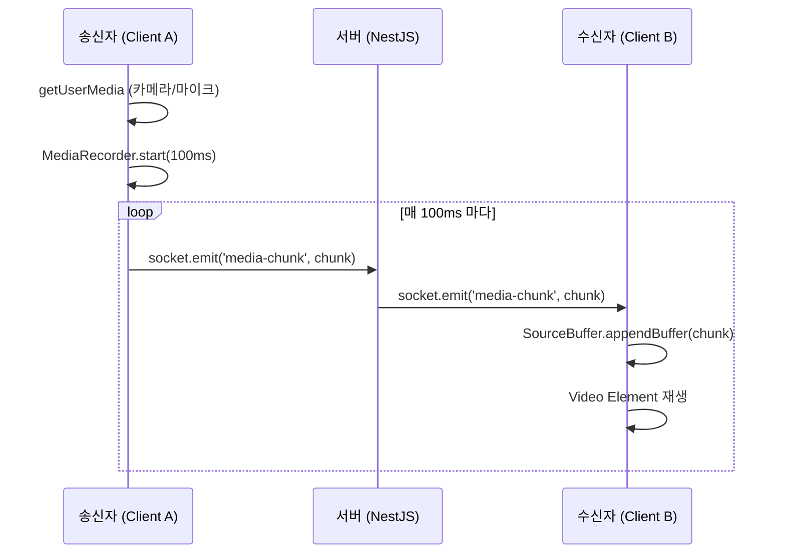

# WebSocket 미디어 스트리밍 흐름 분석

이 문서는 AI Meet 프로젝트에서 웹소켓을 통해 미디어(비디오/오디오) 데이터를 주고받는 과정을 단계별로 설명합니다. 이 프로젝트는 WebRTC의 P2P 연결 대신, **MediaRecorder**와 **WebSocket**, 그리고 **MSE (Media Source Extensions)**를 활용한 릴레이 방식을 사용하고 있습니다.

## 1. 미디어 캡처 (Client)
사용자가 회의실에 입장하거나 카메라/마이크를 켜면 브라우저의 미디어 장치에 접근합니다.

- **함수**: `initializeMediaStream` (`apps/web/app/meeting/[roomId]/meeting-client.tsx`)
- **동작**:
  1. `navigator.mediaDevices.getUserMedia()`를 호출하여 로컬 스트림(`MediaStream`)을 획득합니다.
  2. 획득한 스트림을 `<video>` 태그(`localVideoRef`)에 연결하여 사용자 자신에게 보여줍니다.
  3. `setupMediaRecorder(stream)` 함수를 호출하여 녹화를 준비합니다.

## 2. 인코딩 및 전송 (Client -> Server)
획득한 미디어 스트림을 작은 조각(Chunk)으로 나누어 서버로 전송합니다.

- **함수**: `setupMediaRecorder`
- **동작**:
  1. `MediaRecorder` 객체를 생성합니다. (코덱: VP8/Opus 등 브라우저 지원 코덱 자동 선택)
  2. `mediaRecorder.start(100)`을 호출하여 **100ms** 간격으로 데이터를 자르도록 설정합니다.
  3. `ondataavailable` 이벤트가 발생할 때마다 `socket.emit('media-chunk', ...)`를 통해 서버로 데이터를 보냅니다.
     - **Payload**: `{ chunk: ArrayBuffer, mimeType: string }`

```typescript
// meeting-client.tsx (요약)
mediaRecorder.ondataavailable = (event) => {
  if (event.data.size > 0) {
    socket.emit('media-chunk', { chunk: event.data, mimeType });
  }
};
```

## 3. 중계 (Server)
서버는 받은 미디어 청크를 해당 방에 있는 다른 모든 사용자에게 전달합니다. 별도의 가공이나 저장은 하지 않고 단순 릴레이합니다.

- **파일**: `apps/api/src/events/events.gateway.ts`
- **이벤트 핸들러**: `@SubscribeMessage('media-chunk')`
- **동작**:
  1. 클라이언트로부터 `media-chunk` 이벤트를 수신합니다.
  2. 보낸 사람의 `userId`와 `socketId`를 식별합니다.
  3. `client.to(roomId).emit('media-chunk', ...)`를 사용하여 보낸 사람을 제외한 방의 모든 인원에게 브로드캐스트합니다.

```typescript
// events.gateway.ts (요약)
@SubscribeMessage('media-chunk')
handleMediaChunk(client: Socket, payload: any) {
  // ...
  client.to(roomId).emit('media-chunk', {
    socketId: client.id,
    userId: userId,
    chunk: payload.chunk,
    mimeType: payload.mimeType
  });
}
```

## 4. 수신 및 재생 (Client)
다른 사용자가 보낸 미디어 청크를 받아서 화면에 재생합니다.

- **이벤트 리스너**: `socket.on('media-chunk')`
- **동작**:
  1. 서버로부터 `media-chunk` 이벤트를 수신합니다.
  2. 해당 `socketId`에 대한 `MediaSource`가 없으면 `setupMediaSource`를 호출하여 새로 생성합니다.
  3. `SourceBuffer`에 수신한 청크(`ArrayBuffer`)를 `appendBuffer` 함수로 추가합니다.
  4. 브라우저는 버퍼에 쌓인 비디오 데이터를 자동으로 디코딩하여 `<video>` 태그를 통해 재생합니다.

### 주요 함수: `setupMediaSource`
- **MSE (Media Source Extensions)** API를 사용합니다.
- `MediaSource` 객체를 생성하고 `<video>` 태그의 `src`로 설정합니다 (`URL.createObjectURL`).
- `sourceopen` 이벤트가 발생하면 `addSourceBuffer(mimeType)`을 통해 버퍼를 초기화합니다.

### 버퍼 관리 및 지연 시간 제어
- **메모리 관리**: 버퍼가 너무 많이 쌓이면(`updateend` 이벤트) 오래된 데이터를 `sourceBuffer.remove()`로 삭제하여 메모리 부족을 방지합니다.
- **지연 시간(Latency) 제어**: 네트워크 딜레이로 인해 버퍼가 쌓여 실제 시간과 차이가 발생하면, `playbackRate`를 조절하거나 현재 시점으로 점프(`currentTime` 조정)하여 실시간성을 유지하려고 시도합니다.

## 요약 다이어그램


