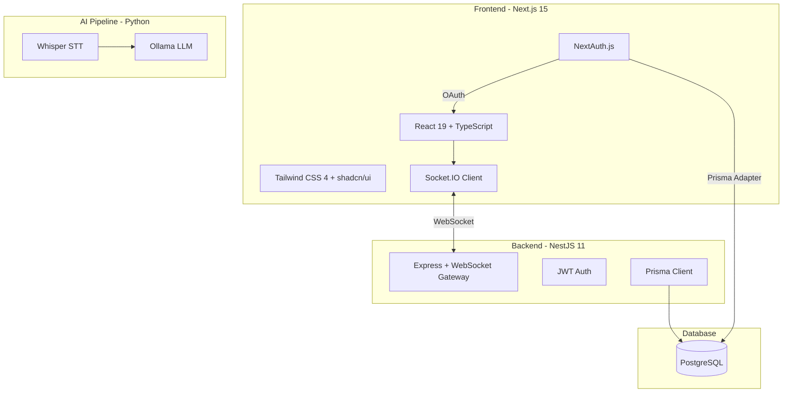

# 🛠️ AI-Meet 프로젝트 기술 스택 총정리

## 프로젝트 구조

**pnpm 모노레포** 구조로, 하나의 루트에서 프론트엔드(web)와 백엔드(api)를 함께 관리합니다.

```
demo-project-1/                  ← 모노레포 루트 (pnpm workspace)
├── ai-meet/apps/
│   ├── web/                     ← 프론트엔드 (Next.js)
│   └── api/                     ← 백엔드 (NestJS)
└── ai_test_venv/                ← AI 테스트 (Python)
```

---

## 📦 패키지 매니저

| 항목 | 기술 |
|------|------|
| **패키지 매니저** | pnpm (워크스페이스 모노레포) |
| **워크스페이스** | `ai-meet/apps/*`, `ai-meet/packages/*` |

---

## 🖥️ 프론트엔드 (`apps/web`)

| 카테고리 | 기술 | 버전 |
|----------|------|------|
| **프레임워크** | **Next.js** (App Router) | `15.5.7` |
| **언어** | **TypeScript** | `^5.9.3` |
| **UI 라이브러리** | **React** | `19.2.0` |
| **CSS 프레임워크** | **Tailwind CSS** | `^4.1.14` |
| **CSS 빌드** | PostCSS + Autoprefixer | `^8.5.6` / `^10.4.21` |
| **UI 컴포넌트** | **shadcn/ui** (Radix UI 기반) | — |
| **아이콘** | **Lucide React** | `^0.545.0` |
| **인증** | **NextAuth.js** (OAuth) | `^4.24.13` |
| **ORM / DB 접근** | **Prisma Client** | `^5.22.0` |
| **실시간 통신** | **Socket.IO Client** | `^4.8.1` |
| **유틸리티** | clsx, tailwind-merge, class-variance-authority, date-fns, uuid | — |
| **코드 품질** | ESLint + eslint-config-next | `^9.37.0` |
| **애니메이션** | tailwindcss-animate | `^1.0.7` |

### shadcn/ui 세부사항
- Radix UI 프리미티브 사용 (`@radix-ui/react-label`, `@radix-ui/react-slot`)
- CSS Variables 기반 테마 (`slate` 베이스 컬러)
- RSC (React Server Components) 지원 모드

---

## ⚙️ 백엔드 (`apps/api`)

| 카테고리 | 기술 | 버전 |
|----------|------|------|
| **프레임워크** | **NestJS** | `^11.0.1` |
| **언어** | **TypeScript** | `^5.7.3` |
| **HTTP 플랫폼** | **Express** (via `@nestjs/platform-express`) | — |
| **실시간 통신** | **Socket.IO** (via `@nestjs/platform-socket.io`, `@nestjs/websockets`) | `^4.8.1` |
| **ORM / DB 접근** | **Prisma Client** | `^5.22.0` |
| **인증** | **jsonwebtoken** (JWT) | `^9.0.2` |
| **설정 관리** | `@nestjs/config` (dotenv 기반) | `^4.0.2` |
| **반응형 프로그래밍** | **RxJS** | `^7.8.1` |
| **메타데이터** | reflect-metadata | `^0.2.2` |
| **터널링** | **Cloudflared** (cloudflare tunnel) | 바이너리 포함 |
| **테스트** | Jest + ts-jest + Supertest | `^30.0.0` |
| **코드 품질** | ESLint + Prettier | — |
| **빌드/실행** | NestJS CLI + ts-node + ts-loader + concurrently | — |

---

## 🗄️ 데이터베이스

| 항목 | 기술 |
|------|------|
| **DBMS** | **PostgreSQL** |
| **ORM** | **Prisma** (`^5.22.0`) |
| **어댑터** | `@next-auth/prisma-adapter` (NextAuth ↔ Prisma 연동) |

### DB 테이블 (6개 모델)
| 모델 | 설명 |
|------|------|
| `User` | 사용자 정보 |
| `Account` | OAuth 계정 연동 |
| `Session` | 세션 관리 |
| `MeetingRoom` | 회의실 |
| `Participant` | 참여자 |
| `ChatLog` | 채팅 기록 |
| `MeetingSummary` | 회의 요약 |
| `VerificationToken` | 인증 토큰 |

---

## 🤖 AI / ML (`ai_test_venv`)

| 카테고리 | 기술 | 비고 |
|----------|------|------|
| **런타임** | **Python 3.13.5** | venv 가상환경 |
| **음성인식 (STT)** | **OpenAI Whisper** (`medium` 모델) | 로컬 실행 |
| **LLM 번역** | **Ollama** (`llama3.1:8b` 모델) | 로컬 실행, REST API |
| **딥러닝 프레임워크** | **PyTorch** (CUDA GPU 지원) | — |
| **HTTP 클라이언트** | requests | — |

---

## 🌐 실시간 통신

| 항목 | 기술 |
|------|------|
| **프로토콜** | **WebSocket** (Socket.IO) |
| **서버** | NestJS WebSocket Gateway (`@nestjs/websockets` + `@nestjs/platform-socket.io`) |
| **클라이언트** | `socket.io-client` (React에서 사용) |
| **기능** | WebRTC 시그널링, 채팅, 화면공유 지원 |

---

## 🔐 인증 체계

| 레이어 | 기술 |
|--------|------|
| **프론트엔드** | NextAuth.js (OAuth 제공자 연동) |
| **백엔드** | JWT (jsonwebtoken) |
| **DB 연동** | Prisma Adapter (`@next-auth/prisma-adapter`) |

---

## 🚀 인프라 / DevOps

| 항목 | 기술 |
|------|------|
| **터널링** | Cloudflare Tunnel (`cloudflared.exe`) — 로컬 서버 외부 노출용 |
| **환경변수** | `.env` 파일 (dotenv) |
| **빌드** | NestJS CLI (api), Next.js (web) |
| **동시 실행** | `concurrently` — 서버 + 터널 동시 실행 |

---

## 📊 한눈에 보기


